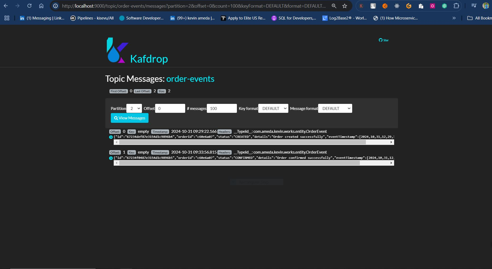
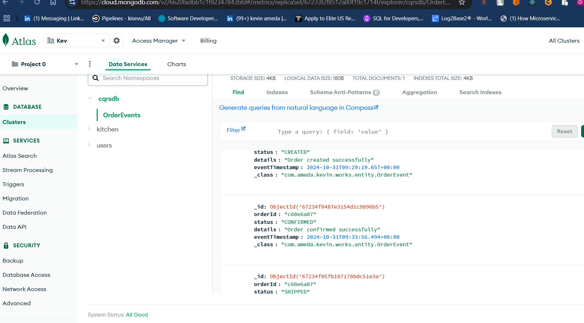

# **Event Sourcing with Apache Kafka and Spring boot: CQRS Design Pattern**
**************************************************************

Microservice event sourcing is a pattern where state changes are logged or stored as a sequence of
immutable events instead of being stored directly in the database.

Event sourcing is an alternative means of storing data using a log of events rather than a table that
is updated, read and deleted.
In event sourcing we tend to create a table and append events to it and they occur, hence building
up once event log.
 
### **_Reading events has got additional steps_**: 
* Read data in.
* Combine events together on runtime kind of a chronological reduce.
* CQRS comes in as a handy tool, where it entails computation when data is written rather than when
when it is read. This ensures that computation is done once no matter how many times the value is read.

### [CQRS (Command Query Responsibility Seggregation)]()
In my case, it is Kafka that provides functionality of Seggregation between the READ and WRITE
operations.
Event logs are written into kafka instead to an actual database. The reason for this is that for a 
database it has indexes which needs to be updated per each traversal.

### Events in the Kafka displayed in the Kafdrop UI

### Events persisted into the mongo db 

